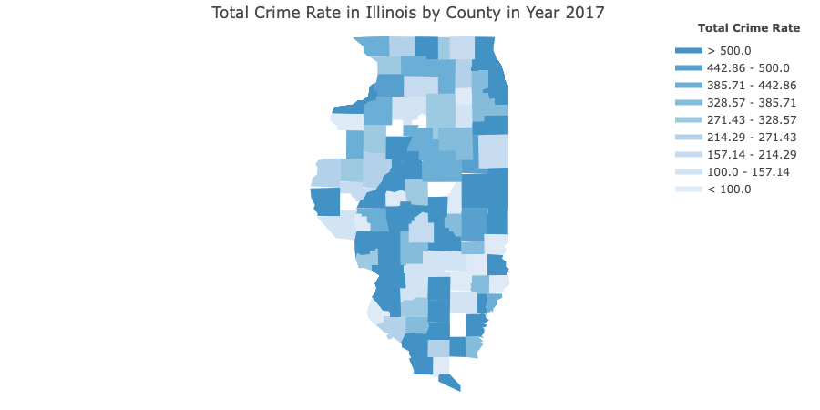

# ChicagoCrime

## Introduction

		This research aims at reevaluating public safety problem in Chicago, more specifically, identifying key features behind blocks with high crime rate and devising public policy solutions accordingly. In most social science literature, demographics are known to exhibit strong correlations with crime; yet, we believe demographics alone are not sufficient to explain this complex issue. Therefore alongside traditional demographics,we introduce two newgroups – infrastructure and traffic flow – to better capture neighborhood characteristics. 
 

		Three types of machine learning techniques are used in this research: unsupervised clustering, supervised regression, and synthetic control method. In unsupervised learning, we apply hierarchical clustering and K-means to select states shared similar demographic features with Illinois. Then, scope is narrowed down to Chicago in the supervised regression part in order to key factors behind its high crime rate. Lastly, we constructed a simulated Chicago using synthetic control method with data of real cities selected from unsupervised learning. This method helps us better understand results of a policy or project.

## Data Source

1. Main Research Data

	1. Crime data (xls):  FBI Offenses Known to Law Enforcement - Crime in the U.S. Archive, including 2010~2018  
	Data downloaded from <https://ucr.fbi.gov/crime-in-the-u.s>
	2. Crime Cases in Chicago in 2019 (csv): City Data Portal of Chicago
	Data downloaded from <https://data.cityofchicago.org/Public-Safety/Crimes-2019/w98m-zvie>
	3. ACS Census data (API): Demographic features  
	Data retrieved via Census API as: <https://www.census.gov/data/developers/data-sets/acs-1year.html>
	4. Property Value (csv): <https://www.experian.com/blogs/ask-experian/research/median-home-values-by-state/>
	5. Facility Data (API): from City Data Portal: <https://data.cityofchicago.org/>
	6. Taxi Trips (API): from Chicago Data Portal: <https://data.cityofchicago.org/>
2. Supportive Data

	1. Census tract boundaries (geojson): Census tract for Chicago

	2. State-County-City Match (csv): From government website

## Directory
1. Data: all data used in this research except API data.  

2. Codes:
	1. Read files
		1. read_FBI_data.py

			Read in FBI xlsx files, clean and transform data.

		2. read_facility_data.py

			Retrieve city facility data via City Data Portal API.

	2. Visualization files
		1. pl_choropleth_map.py

			Create county-level crime-rate interactive choropleth plot.

			
			

		2. pl_heat_map.py

			Create heat map of homicide cases in Chicago on Google Map.

		3. pl_type_count.py

	3. Machine Learning files
		1. ml_unsupervised_clustering.py

			In this part, we use unsurpervised machine learning algorithms to divide 51 states of U.S. into three groups based on demographic features and crime rates. We applied both hierarchical clusteirng and k-means and selected states in the same group with Illinois in both methods for further analysis.

			1. Hierarchical Clustering: Ward

			2. K-means: K = 3

		2. ml_supervised_regression.py

			In this part, we regress crime rate by block against facility data. Data are splitted into training(80%) and testing set(20%) and normalization is performed before regression. Also, we applied bootstrapping to test stability of the model. 

3. Report and Slides: final report and presentation slides
